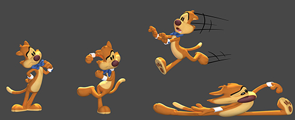
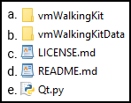
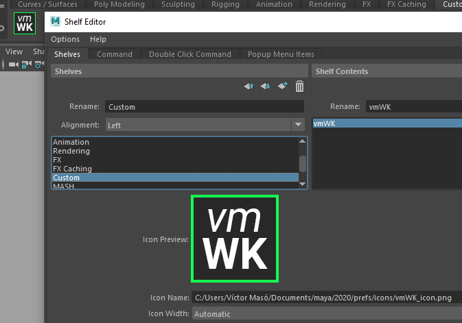
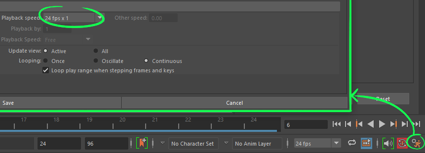
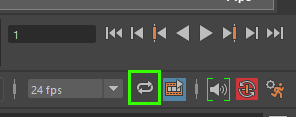
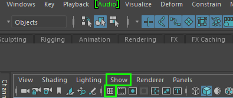
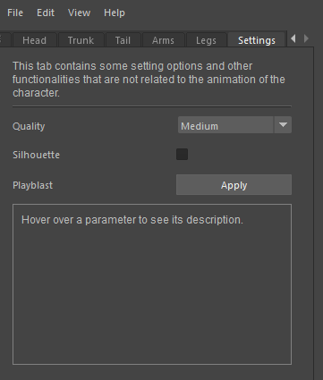

# vmWalkingKit


*vmWalkingKit* is an animation tool for Maya developed with Python for my Bachelor's Thesis. The tool's goal is to offer an interactive study about the theory behind walk cycles by providing the user with a playground to experiment with. This will be achieved through an easy-to-use UI that will allow the animator to tweak parameters in order to modify the end result of a character walking animation. The parameters will be divided into sections representing the main parts of the body.

The program will also come with a set of tool tips and useful information regarding walking animations and the available parameters. This tool is heavily based on the theory of *The Animator's Survival Kit* by Richard Williams; as it contains one of the best studies on the subject of walking.

*Development & animation by [Víctor Masó Garcia.](https://www.linkedin.com/in/vmasogarcia/)*

You can wath the showcase video [here](https://vimeo.com/431497237).

## Attributions

[Mr. Buttons](https://www.bloomsbury.com/cw/cartoon-character-animation-with-maya/student-resources/mr-buttons/) rig by [Keith Osborn](http://www.keithosborn.com/).


 
# Installation instructions

**DISCLAIMERS:** 
* The tool should work with Maya 2017-2020 but it will perform best with later versions of Maya, especially with Maya 2019 and 2020. 
* When closing the tool, **always use the File->Quit option**. Do this operation before closing Maya or opening a new scene. 

You can watch this 10-minute installation tutorial [video](https://vimeo.com/430754588) too instead of reading all the following steps.

1. Download the latest release .zip from the release [section](https://github.com/nintervik/vmWalkingKit/releases) of the repository and unzip it anywhere on your computer.<br/>
2. Inside the *vmWalkingKit_v0.#* folder (where # is the version number of the tool), you’ll find six items:<br/>
  
   
   
3. Move both the *vmWakingKit* folder and the script *Qt.py* (a. and f.) to the following directory: *C:\Users\UserName\Documents\maya\version\scripts* Where:
   - *C:* is the drive where Maya is installed.
   - *UserName* is the name of your user in Windows.
   - *version* is the version number of Maya that you want to use (2017-2019)<br/>
4. And then, move the *vmWalkingKitData* folder (b.) to the following directory:     
*C:\Users\UserName\Documents\maya*<br/>
5. Open the Maya version corresponding to where you’ve put the files.<br/>
6. Go to File→Set Project and navigate to the *vmWalkingKit* folder. Inside you’ll find another folder called *mayaProject*. Set that folder as the project.<br/> 
7. In Maya, go to File→Open Scene (Ctrl+O) and open the *characterScene*. You'll find the scene file in *mayaProject/scenes*.<br/>
8. Open the Script Editor by clicking on the bottom right button with the {;} or by going to Windows→General Editors→Script Editor.<br/>
9. Click on the + icon in the tabs section to open up a new tab. Choose Python as the executer source language.<br/>
10. In this tab, paste the following code:<br/>     
```python
from vmWalkingKit.vmWalkingKitFiles import libraryUI

reload(libraryUI)
libraryUI.WalkLibraryUI()
```
**Important:** it is possible that when you paste the code above into the Script Editor the lines are indented (they contain spaces before them). Just make sure to delete any spaces before the lines; if the lines are indented the code won't compile at all.

11. Open the Custom tab in Maya’s Shelf. If the the Shelf is not visible, go to Windows→UI Elements→Shelf.<br/>  
12. Still with the this tab opened and inside the Script Editor, go to File→Save Script To Shelf…, write a name for it (e.g. *vmWK*) and click Ok. An icon with the chosen name should have appeared in the Custom Shelf tab.<br/>


**Optional:** In case, you want the tool icon to show up instead of the Maya's Pyhton default one this can be done quickly. Right click on the new created shelf icon and go to Edit. Go the the Shelves tab and in the Icon Name field you will see a browse icon folder. The default path usually is *C:/Users/UserName/Documents/maya/mayaVersion/prefs/icons/*. You can move the icon image (*vmWK_icon.png*) from step 1 into that folder or any other that you like. Then, just navigate to the folder where you moved the icon image and select it. Leave the Icon Width field to automatic. And press the Save All Shelves button at the bottom left of the window. The icon should be changed for the tool one as in the below image.



13. Now, you can click on that icon once and the tool will be opened. You can resize the window and dock it anywhere you want as any other Maya's native window.<br/>

14. Before starting to use the tool, make sure to set the playback speed to *24 fps x 1* and that the playback is set to loop.<br/>





**Side note 1:** if you click on the shelf icon and you cannot see the tool window check the following cases in order:
* The tool is probably minimized as a tab on the right side of the screen (usually next to the Attribute Editor or the Channel Box tab).
* If you still cannot see it try opening a tab that is docked the right side of the screen (e.g the Attribute Editor); then, the tool tab will probably pop up. 
* The tool window may as well be minimized on the bottom left of Maya.

**Side note 2:** please do not delete any of the files that come with the release as they might be crucial in order to run the tool.

**Side note 3:** for a cleaner view, you can hide the grid by going to *Show->Grid* or by clicking on the grid icon. 



The background color can also be changed: press ALT+B to cycle through the different default colors. You can also go to *Windows->Settings/Preferences->Color Settings->General->3D Views* to tweak the background colors to your taste.  

# How to use the tool

You can watch an 8-minute video about how to use the tool [here](https://vimeo.com/432083999).

The tool is divided into three parts:

1. **The animation tabs:** each tab represents a body part of the character. Navigate through them to see all the possible options (the last one is related to the settings of the tool).
2. **The tabs content:** in each tab you'll find different parameters, hover over them to see their descriptions and tips about how to use them.
3. **Bottom buttons:** you'll find three buttons at the bottom of the tool to reset the parameters, import or save a preset. If you like a combination you can save the preset anywhere on your computer and import it later. There's already a five presets in the *vmWalkingKitData/vmWalkingKitPresets/PresetsExamples* folder if you want to load them up into the tool.


# About performance

The tool uses a lot of animation layers in order to create all the combinations. That has a considerable hit on performance that may affect your overall experience with the tool. In order to smooth out the potential performance issues it's recommended to follow these tips (in case of bad performance):

1. If you are using Maya 2019 or 2020 activate the Cached Playback option (*Playback → Cached Playback → Cached Playback*). If you can see the playback menu, check that you have the Animation menu set selected. You can find a drop-down menu to change this in the top left corner.


2. In the settings tab of the tool (the last one) you'll find information about how to minimize perfomance issues. Make sure to check that section if you run into performance problems.



3. Before changing any parameter or importing/saving a preset pause the animation and play it back once the changes are done.
3. Close any other programs that you don't need while using the tool. 

You can visualize the framerate of the scene by looking at the number displayed on the right bottom corner of the viewport. Anything below 20 fps is an indication of bad performance.


# Changelog

Down below you'll find the changelog for each version of tool along with the
correspondent showcase video illustrating the new features (for the most important versions only).

v0.1 ([video](https://vimeo.com/402131641)):
* Code structure is done.
* The tool can be reset to its default values by reading from a JSON file.
* General tab works and the respective animations are done.
* Animations always loop correctly.
* Animations adapt to the beat.
* UI is native and usable (resizable, with scrollbar, can be docked,
etc)
* Performance issues are fixed.

v0.5 ([video](https://vimeo.com/413653094)):
* Head, trunk, arms tabs and animations are done.
* Section for the information display works (with placeholder text).
* Presets can be saved and imported into the tool.

v0.9 ([video](https://vimeo.com/417271920)):
* Tail, hands poses, and legs parameters work and are animated.
* All the theory and information are written and displayed where
needed.
* Settings tab is implemented (performance, silhouette, and playblast).

v0.91:
* Fixed loop animation issues.
* FPS are now always displayed.
* Added a combination preset as an example file.
* Updated README with information about how to use and install the tool.
* Updated Maya 2018 file.

v0.92:
* Added startup window.
* Added about window.
* Top menu bar is now functional with options the following options: import, save, reset, quit, open startup window, open about window, and open the tool website with the documentation.
* Added icon image for the tool.
* Polished upper body animations (hips, spine, and chest).
* Polished feet animations.
* Fixed knee pops for 12f beat.
* Fixed head nodding animation offset.
* Fixed arm range in 8f beat.
* Improved facial expressions with asymmetry and more appealing faces. 
* Improved hands relaxed pose.
* Improved README installation instructions.

v0.95:
* Fixed more knee pops.
* Added overlap animation on bow-tie.
* Added overlap animation on ears.
* Added overlap animation on nose.
* Added overlap animation on hair.
* Added overlap animation on cheeks
* Added overlap animation on
* Cleaned code for overlapping action.
* Added circular mini-floor to the scene.
* Improved README installation instructions.

v0.98:
* Added 5 presets for visual reference: angry, cocky, sad, goofy, and scared.
* Completed all TODOs in the code.
* Added docstrings to all the methods, functions, and classes.
* Added explanatory comments to the code.
* Toned down the cheek overlapping action animations.
* Fixed UI text typos.
* Fixed UI text box size for smaller aspect ratios.
