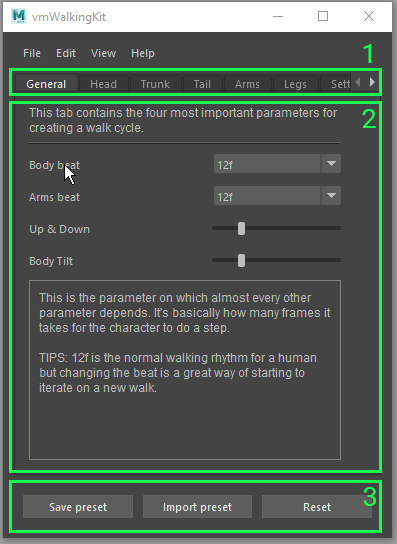
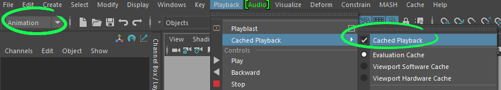

# About

*vmWalkingKit* is an animation tool for Maya developed with Python for my Bachelor's Thesis. The tool's goal is to offer an interactive study about the theory behind walk cycles by providing the user with a playground to experiment with. This will be achieved through an easy-to-use UI that will allow the animator to tweak parameters in order to modify the end result of a character walking animation. The parameters will be divided into sections representing the main parts of the body.

The program will also come with a set of tool tips and useful information regarding walking animations and the available parameters. This tool is heavily based on the theory of *The Animator's Survival Kit* by Richard Williams; as it contains one of the best studies on the subject of walking.

Development and animation by [Víctor Masó Garcia](https://www.linkedin.com/in/vmasogarcia/).

You can check my other work in my [website](https://nintervik.github.io).

> Download the latest release [here](https://github.com/nintervik/vmWalkingKit/releases/tag/v0.91)

<iframe src="https://player.vimeo.com/video/417271920" width="640" height="360" frameborder="0" allow="autoplay; fullscreen" allowfullscreen></iframe>
<p><a href="https://vimeo.com/417271920">vmWalkingKit v0.9</a> from <a href="https://vimeo.com/nintervik">V&iacute;ctor Mas&oacute; Garcia</a> on <a href="https://vimeo.com">Vimeo</a>.</p>

***

# Attributions

[Mr. Buttons](bloomsbury.com/cw/cartoon-character-animation-with-maya/student-resources/mr-buttons/) rig by [Keith Osborn](http://www.keithosborn.com/).


# Installation instructions

**DISCLAIMER:** the tool should work with Maya 2017-2020 but it will perform best with later versions of Maya, especially with Maya 2019 and 2020. 

1. Download the latest release .zip from the release [section](https://github.com/nintervik/vmWalkingKit/releases) of the repository and unzip it anywhere on your computer.<br/>
2. Inside the *vmWalkingKit_v091* folder, you’ll find five items:<br/>
  
   
   
3. Move both the *vmWakingKit* folder and the script *Qt.py* (a. and e.) to the following directory: *C:\Users\UserName\Documents\maya\version\scripts* Where:
   - *C:* is the drive where Maya is installed.
   - *UserName* is the name of your user in Windows.
   - *version* is the version number of Maya that you want to use (2017-2019)<br/>
4. And then, move the *vmWalkingKitData* folder (b.) to the following directory:     
*C:\Users\UserName\Documents\maya*<br/>
5. Open the Maya version corresponding to where you’ve put the files.<br/>
6. Go to File→Set Project and navigate to the *vmWalkingKit* folder. Inside you’ll find another folder called *mayaProject*. Set that folder as the project.<br/> 
7. In Maya, go to File→Open Scene (Ctrl+O) and open the *characterScene_#* where *#* is the Maya version you’re using. You'll find the scene file in *mayaProject/scenes*. If you can't find your version open the file which has the closer version to the one you're using.<br/>
8. Open the Script Editor by clicking on the bottom right button with the {;} or by going to Windows→General Editors→Script Editor.<br/>
9. Click on the + icon in the tabs section to open up a new tab. Choose Python as the executer source language.<br/>
10. In this tab, paste the following code:<br/>     
```python
   from vmWalkingKit.vmWalkingKitFiles import libraryUI

   reload(libraryUI)
   libraryUI.WalkLibraryUI()
```
**Important:** make sure that there aren't indented lines when you paste the code in Maya's Script Editor.

11. Open the Custom tab in Maya’s Shelf. If the the Shelf is not visible, go to Windows→UI Elements→Shelf.<br/>  
12. Still with the this tab opened and inside the Script Editor, go to File→Save Script To Shelf…, write a name for it (e.g. *vmWK*) and click Ok. An icon with the chosen name should have appeared in the Custom Shelf tab.<br/>


13. Now, you can click on that icon once and the tool will be opened. You can resize the window and dock it anywhere you want as any other Maya's native window.<br/>

14. Make sure to set the playback speed to *24 fps x 1* before starting to use the tool.<br/>


**Side note 1:** if you click on the shelf icon and you cannot see the tool window check the following cases in order:
* The tool is probably minimized as a tab on the right side of the screen (usually next to the Attribute Editor or the Channel Box tab).
* If you still cannot see it try opening a tab that is docked the right side of the screen (e.g the Attribute Editor); then, the tool tab will probably pop up. 
* The tool window may as well be minimized on the bottom left of Maya.

**Side note 2:** please do not delete any of the files that come with the release as they might be crucial in order to run the tool.

# How to use the tool

The tool is divided into three parts:

1. **The animation tabs:** each tab represents a body part of the character. Navigate through them to see all the possible options (the last one is related to the settings of the tool).
2. **The tabs content:** in each tab you'll find different parameters, hover over them to see their descriptions and tips about how to use them.
3. **Bottom buttons:** you'll find three buttons at the bottom of the tool to reset the parameters, import or save a preset. If you like a combination you can save the preset anywhere on your computer and import it later. There's already a couple of presets if you want to load them up into the tool.



# About performance

The tool uses a lot of animation layers in order to create all the combinations. That has a considerable hit on performance that may affect your overall experience with the tool. In order to smooth out the potential performance issues it's recommended to follow these tips (in case of bad performance):

1. If you are using Maya 2019 or 2020 activate the Cached Playback option (*Playback → Cached Playback → Cached Playback*). If you can see the playback menu, check that you have the Animation menu set selected. You can find a drop-down menu to change this in the top left corner.



2. In the settings tab of the tool (the last one) you'll find information about how to minimize perfomance issues. Make sure to check that section if you run into performance problems.


3. Before changing any parameter or importing/saving a preset pause the animation and play it back once the changes are done.
3. Close any other programs that you don't need while using the tool. 

You can visualize the framerate of the scene by looking at the number displayed on the right bottom corner of the viewport. Anything below 20 fps is an indication of bad performance.


# License

~~~~~~~~~~~~~~~

MIT License

Copyright (c) 2020 nintervik

Permission is hereby granted, free of charge, to any person obtaining a copy
of this software and associated documentation files (the "Software"), to deal
in the Software without restriction, including without limitation the rights
to use, copy, modify, merge, publish, distribute, sublicense, and/or sell
copies of the Software, and to permit persons to whom the Software is
furnished to do so, subject to the following conditions:

The above copyright notice and this permission notice shall be included in all
copies or substantial portions of the Software.

THE SOFTWARE IS PROVIDED "AS IS", WITHOUT WARRANTY OF ANY KIND, EXPRESS OR
IMPLIED, INCLUDING BUT NOT LIMITED TO THE WARRANTIES OF MERCHANTABILITY,
FITNESS FOR A PARTICULAR PURPOSE AND NONINFRINGEMENT. IN NO EVENT SHALL THE
AUTHORS OR COPYRIGHT HOLDERS BE LIABLE FOR ANY CLAIM, DAMAGES OR OTHER
LIABILITY, WHETHER IN AN ACTION OF CONTRACT, TORT OR OTHERWISE, ARISING FROM,
OUT OF OR IN CONNECTION WITH THE SOFTWARE OR THE USE OR OTHER DEALINGS IN THE
SOFTWARE.

~~~~~~~~~~~~~~~
